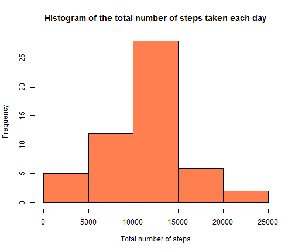

Reproducible Research: Peer Assessment 1
========================================================


### Loading and preprocessing the data
If we do not have the data, we can download it.

```r
# url <- "https://d396qusza40orc.cloudfront.net/repdata%2Fdata%2Factivity.zip"
# dest <- "./repdata_data_activity.zip"
# download.file(url, dest)
# unzip(dest)
```

Loading the data (using read.csv()). Missing values are coded as NA. 

```r
data<-read.csv("./activity.csv"
               ,header=TRUE
               ,sep=","
               ,na.strings="NA"
               ,colClasses=c("integer","Date","integer") )
```
The transforming the data into a format suitable is following:

```r
data_steps <- aggregate(steps ~ date, data = data, sum, na.rm = TRUE)
data_interval <- aggregate(steps ~ interval, data = data, mean, na.rm = TRUE)
```
I created two sets, the first is sum of steps divided into date and the second - mean of steps divided into interval.


### What is mean total number of steps taken per day?

Below you can find a histogram of the total number of steps taken each day

```r
hist(data_steps$steps
     ,main="Histogram of the total number of steps taken each day"
     ,xlab="Total number of steps"
     ,col="coral")
```

 

The code for calculate the mean and median total number of steps taken per day is following:

```r
mean(data_steps$steps)
```

```
## [1] 10766
```

```r
median(data_steps$steps)
```

```
## [1] 10765
```


### What is the average daily activity pattern?

I made a time series plot of the 5-minute interval (x-axis) and the average number of steps taken, averaged across all days (y-axis).

```r
graphics.off()
plot(data_interval$interval
     ,data_interval$steps
     ,type="l"
     ,main="The average number of steps taken, averaged across all days"
     ,xlab="5-minute interval"
     ,ylab=""
     ,col="brown")
```

The following line of code shows us which 5-minute interval, on average across all the days in the dataset contains the maximum number of steps.

```r
data_interval[which.max(data_interval$steps), ]$interval
```

```
## [1] 835
```


### Imputing missing values
We can calculate and report the total number of missing values in the dataset using two simple lines.

```r
summary(data)
```

```
##      steps            date               interval   
##  Min.   :  0.0   Min.   :2012-10-01   Min.   :   0  
##  1st Qu.:  0.0   1st Qu.:2012-10-16   1st Qu.: 589  
##  Median :  0.0   Median :2012-10-31   Median :1178  
##  Mean   : 37.4   Mean   :2012-10-31   Mean   :1178  
##  3rd Qu.: 12.0   3rd Qu.:2012-11-15   3rd Qu.:1766  
##  Max.   :806.0   Max.   :2012-11-30   Max.   :2355  
##  NA's   :2304
```

```r
length(data[data$steps=="NA",1])
```

```
## [1] 2304
```

```r
sum(is.na(data$steps))
```

```
## [1] 2304
```
As we see the data has 2304 empty values.

We can fill in these lacks using the mean of all datas for which we know number of steps. Additional I took the floor of the mean, because we fill in the number of steps (it should be integer)

```r
floor(mean(data$steps, na.rm=TRUE))
```

```
## [1] 37
```

I copied the data to data_new and filled in empty values by the floor of mean.

```r
data_new<-data
data_new[is.na(data_new$steps),1]<-floor(mean(data$steps, na.rm=TRUE)) 
```

At the end we can show the histogram of the total number of steps taken each day. For this I created the helpful dataset.

```r
data_steps_new <- aggregate(steps ~ date, data = data_new, sum, na.rm = TRUE)
hist(data_steps_new$steps
     ,main="Histogram of the total number of steps taken each day"
     ,xlab="Total number of steps"
     ,col="aquamarine4")
```

 

We can compare two dataset using summary().

```r
mean(data_steps_new$steps)
```

```
## [1] 10752
```

```r
median(data_steps_new$steps)
```

```
## [1] 10656
```


### Are there differences in activity patterns between weekdays and weekends?
I created a new factor variable with two levels – “weekday” and “weekend” indicating whether a given date is a weekday or weekend day and linked this with our data.

```r
part_week<-rep("weekday", length(data_new$date))
for (i in 1:length(data_new$date)) {
  if (weekdays(data_new$date[i]) == "sobota" || weekdays(data_new$date[i]) == "niedziela") {
    part_week[i]<-"weekend"
  }
}
data_new<-cbind(data_new,part_week)
```

To make a panel plot containing a time series plot of the 5-minute interval (x-axis) and the average number of steps taken, averaged across all weekday days or weekend days (y-axis) I created some helpful datasets. I took only rows with "weekend" or "weekday", splited them by interval and calculated mean.

```r
steps = aggregate(steps ~ interval + part_week, data_new, mean)
steps_weekend = steps[steps$part_week=="weekend",]
steps_weekday = steps[steps$part_week=="weekday",]
```

The following code creates the plot using the basic plotting system.

```r
par(mfrow=c(2,1))
# row 1 col 1
plot(steps_weekend$steps
     ,x=steps_weekend$interval
     ,xlab="Interval"
     ,ylab=""
     ,main="Mean total number of steps taken at weekends"
     ,col="mediumvioletred"
     ,type="l")
# row 2 col 1
plot(steps_weekday$steps
     ,x=steps_weekday$interval
     ,xlab="Interval"
     ,ylab=""
     ,main="Mean total number of steps taken at weekdays"
     ,col="khaki"
     ,type="l")
```

 
